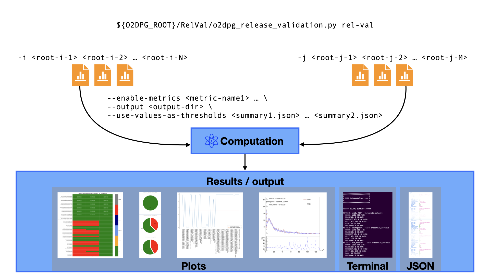

# ReleaseValidation (RelVal)

The RelVal is specifically designed to compare 2 sets of QC objects. However, it is also possible to compare ROOT files that contain other objects such as histograms (`TH1`) or also `TTree`s:
* ROOT histograms (deriving from `TH1`)
* ROOT `TProfile`
* ROOT `TEfficiency`
* O2 `o2::quality_control::core::MonitorObjectCollection`
* O2 `o2::quality_control::core::MonitorObject`
* ROOT `TTree` (Here the algorithm does its best to extract as many TLeafs as possible which works when they can be drawn with `TTree::Draw`.)

Objects from compared files are extracted recursively and so all objects in sub-directories are compared.

The convention is, that only those objects that have the exact same path are compared to one another so the 2 ROOT files must have the same structure. Note though, that all possible pairs are compared. If there are singular objects in one or the other file, they will be safely ignored.

At the end of this README are some examples for QC RelVal.

## Prerequisites

For basic `ROOT` objects, no special environments need to be loaded. However, in order to run on QC output, `QualityControl` needs to be loaded.
Probably the easiest is to simply load `O2sim` or `O2PDPSuite` which both contain all necessary dependencies including `QualityControl`.

## Quick start

To jump right in, please check out [this](#run-for-qc)

## Definitions

### Metric
A metric is a way to compare 2 corresponding objects and assign a number to that comparison. There are currently 3 definitions:
1. `chi2`: Chi2 test of compared histograms (see also the [ROOT documentation](https://root.cern.ch/doc/master/classTH1.html#ab7d63c7c177ccbf879b5dc31f2311b27)),
1. `kolmogorov`: shape comparison using Kolmogorov test (see also the [ROOT documentation](https://root.cern.ch/doc/master/classTH1.html#aeadcf087afe6ba203bcde124cfabbee4)),
1. `num_entries`: relative difference in the number of entries.
So for each pair of histograms there can be multiple metrics.

### Test
A test is the comparison of a computed metric to certain limits (upper,lower). How these limits came about is the property of such a test. For instance, a simple **threshold** test, where lower is better, would mean to have limits of `(<threhsold>, -infty)`.
There can hence be multiple tests for one metric.

### Interpretation
A test can be assigned an interpretation. There are
1. `GOOD` if a metric passes a test,
1. `WARNING`: if a **non-critical** metric fails a test,
1. `NONCRIT_NC` if the objects could not be compared e.g. due to different binning or axis ranges **and** if the metric is considered **non-critical**,
1. `CRIT_NC` if the histograms could not be compared e.g. due to different binning or axis ranges **and** if the metric is considered **critical**,
1. `BAD` if a test of a amtric fails that is considered **critical**
1. `UNKNOWN` used for instance when a test might have been defined but no metric was passed to be tested.

## Usage

The [Python script](https://github.com/AliceO2Group/O2DPG/tree/master/RelVal/o2dpg_release_validation.py) is the entrypoint of the RelVal and it has multiple sub-commands.

The full help message of this script can be seen by typing
```bash
${O2DPG_ROOT}/RelVal/o2dpg_release_validation.py [<sub-command>] --help
```
The wrapper includes 3 different sub-commands for now
1. `rel-val` to steer the RelVal,
1. `inspect` to print histograms of specified severity (if any),
1. `compare` to compare the results of 2 RelVal runs,
1. `print` simply print object names, metric names or test names line-by-line to the command line; convenient to further digest the output,
1. `influx` to convert the summary into a format that can be understood by and sent to an InfluxDB instance.

Each sub-command can be run with `--help` to see all options/flags.

### `rel-val`

If you would like to compare 2 files (or sets of files), simply run
```bash
${O2DPG_ROOT}/RelVal/o2dpg_release_validation.py rel-val -i <first-list-of-files> -j <second-list-of-files> \
                                                         [--include-dirs <list_of_include_patterns>]
```
It will run the full release validation, dumps plots and further artifacts in the directory `rel_val` and prints a result summary in the terminal.
Via the optional `--include-patterns` a list of patterns can be passed so that only those ROOT sub-directories are taken into consideration which contain at least on of those patters, **Note** though, that regular expressions cannot (yet) be used.

For the comparison of 2 sets of files this is always the first necessary step and of the most important outputs produced is `rel_val/Summary.json` which contains all the test results. It can be used for further and also more in-depth studies as mentioned in the following.

There are also various plots created during the RelVal run. For each compared file there are
* overlay plots, 1D and 2D (to be found in the sub directory `overlayPlots`),
* 2D plots summarising the interpretations in a grid (called `SummaryTest.png`),
* pie charts showing the fraction of interpretations per metric (and potentially per test, if there are multiple),
* 1D plots showing the computed value and test means per metric (and potentially per test, if there are multiple).


### `inspect`
This command requires that a `rel-val` was run previously which produced a `<output_dir>/Summary.json`.

Imagine you would like to change or experiment with some settings, e.g. you would like to only take objects with certain names into account or only enable certain metrics etc. These things you like to see reflected in the summary as well as in the produced plots.
This is possible with
```bash
${O2DPG_ROOT}/RelVal/o2dpg_release_validation.py inspect --path <path-to-outputdir-or-summary-json> \
                                                        [--include-patterns <patterns>] [--exclude-patterns <patterns>] \
                                                        [--enable-metric <metric_names>] [--disable-metric <metric_names>] \
                                                        [--interpretations <interpretations_of_interest>] \
                                                        [--critical <metric_names_considered_critical>] \
                                                        [--output|-o <target_directory>]
```
All of those options, except for `--include-patterns` and `--exclude-patterns` also work with the `rel-val` command.
The output will by default be written to `rel_val_inspect`. All plots which are produced by the `rel-val` command are produced again for a potential given sub-set depending on the given options. Only the overlay plots are not produced again.

**NOTE** that with `inspect` the original overlay plots satisfying your selection criteria (e.g. `--include-patters` or `--interpretations`) are also copied over to the target directory.

**Other additional optional arguments**
* `--use-values-as-thresholds [<list_of_other_Summary.json_files>]`: By passing a set of summaries that where produced from `rel-val`, the computed metric values can be used as **new** thresholds. To decide how to combine the values for multiple metrics referring to the same object, the option `--combine-thresholds mean|extreme` can be used. Also, an additional relative margin can be added for each metric with `--margin-threshold <metric> <percent>`; this argument must be repeated for if it should be used for multiple metrics.
* `--regions [<list_of_other_Summary.json_files>]`: This computes means and standard deviations for each metric from previously computed values. The corresponding test is passed, if the value lies around the mean within the standard deviations. The deviation from the mean is also given as number-of-sigmas in the summary grid.
* `rel-val -i <file1> -j <file2> --no-extract` runs RelVal on **flat** ROOT files that have only histogram objects in them.

### `print`
This command has the same optional arguments as the `inspect` command. But the only thing it does is writing some information line-by-line. For instance, to get the object names that were flagged `BAD` by the `chi2` metric, do
```bash
${O2DPG_ROOT}/RelVal/o2dpg_release_validation.py print --path <path-to-outputdir-or-summary-json> --enable-metric chi2 --interpretations BAD
```
If no RelVal was run but one would like to know the available metrics, one can check with
```bash
${O2DPG_ROOT}/RelVal/o2dpg_release_validation.py print --metric-names
```

### `influx`

To convert the final output to something that can be digested by InfluxDB, use
```bash
${O2DPG_ROOT}/RelVal/o2dpg_release_validation.py influx --dir <rel-val-out-dir> [--tags k1=v1 k2=v2 ...] [--table-name <chosen-table-name>]
```
When the `--tags` argument is specified, these are injected as TAGS for InfluxDB in addition. The table name can also be specified explicitly; if not given, it defaults to `O2DPG_MC_ReleaseValidation`.

## RelVal for QC (examples)

### Comparing data with MC

There is an ongoing effort to unify the names of QC objects inside MC and data QC files. Some are already unified and the following command would run comparison of those. However, others are not yet unified and will not be considered in the comparison.

MC QC objects are usually distributed over multiple files while those from data are all contained in one single file. It is possible to directly compare them with
```bash
${O2DPG_ROOT}/RelVal/o2dpg_release_validation.py rel-val -i ${MC_PRODUCTION}/QC/*.root -j ${DATA_PRODUCTION}/QC.root [--include-dirs <include-directories>]
```

## Run for QC
This is a simple guide to run RelVal for QC.

Here is also a [working example](https://github.com/AliceO2Group/O2DPG/tree/master/RelVal/run/run_data_rel_val.sh), run it with
```bash
${O2DPG_ROOT}/RelVal/run/run_data_rel_val.sh [--qc QC1.root QC2.root ] [--aod AOD1.root AOD2.root] [ --labels LABEL1 LABEL2]
```

### If you are interested in all QC plots
To have everything and to use this as a starting point for deeper inspections, first run
```bash
${O2DPG_ROOT}/RelVal/o2dpg_release_validation.py rel-val -i QC_file_1.root -j QC_file_2.root -o rel_val_all [--labels meaningfulLabel1 meaningfulLabel2]
```
Now, there is of course a lot but from now on you are fully flexible.

In order to get some insight into a specific detector, say ITS, run
```bash
${O2DPG_ROOT}/RelVal/o2dpg_release_validation.py inspect --path rel_val_all --include-patterns "^ITS_" -o rel_val_ITS
```
This will only print pie charts and summaries for ITS and also copies all overlay plots related to ITS to your target directory `rel_val_ITS`.

The `inspect` command is much faster now since no new plots are generated and metrics do not have to be recomputed. It simply filters the results according to your criteria. However, what can be re-evaluated are the computed values against new thresholds.

### If you are only interested in some ROOT sub-directories to begin with
If you only want to study for instance the ITS and CPV and there is no interest at this point to study any other detector, run
```bash
${O2DPG_ROOT}/RelVal/o2dpg_release_validation.py rel-val -i QC_file_1.root -j QC_file_2.root -o rel_val_all --include-dirs ITS CPV [--labels meaningfulLabel1 meaningfulLabel2]
```
From here on, you can use the `inspect` command as usual. But there will never be detectors other than ITS and CPV.

### Troubleshooting

If there are unexpected segmentation faults or similar, most likely the `QualityControl` software is not properly linked against `O2`. Most likely, the reason is that `QC` was not rebuild against the loaded `O2` version.
The easiest solution would be to load either `QualityControl` or meta packages such as `O2sim`.
Loading like `O2/latest,QualityControl/latest` can cause problems depending on how the single packages were build.


## Development section and code organisation

The global entry point is
```bash
${O2DPG_ROOT}/RelVal/o2dpg_release_validation.py
```
with its various sub-commands as explained [above](#usage). Each sub-command is assigned its entry point function in that script. Each sub-command has its own help message that can be seen with the `--help` flag.

### Python part
In addition, the script contains a small number of direct helper functions.
Other utility functions as well as the definition of the `RelVal` class are contained in [o2dpg_release_validation_utils.py](https://github.com/AliceO2Group/O2DPG/tree/master/RelVal/utils/o2dpg_release_validation_utils.py). In addition, [o2dpg_release_validation_plot.py](https://github.com/AliceO2Group/O2DPG/tree/master/RelVal/utils/o2dpg_release_validation_plot.py) contains the functionality for plotting and there is [o2dpg_release_validation_plot_root.py](https://github.com/AliceO2Group/O2DPG/tree/master/RelVal/utils/o2dpg_release_validation_plot_root.py) for `ROOT`-specific plotting functionality.
Some global variables are found in [o2dpg_release_validation_variables.py](https://github.com/AliceO2Group/O2DPG/tree/master/RelVal/utils/o2dpg_release_validation_variables.py).

Another special script is [o2dpg_overlay_plots.py](https://github.com/AliceO2Group/O2DPG/tree/master/RelVal/o2dpg_overlay_plots.py) which can be used to produce overlay plots from arbitrary `ROOT` files. This is not directly a RelVal feature but makes direct use of some of the implemented functionality to achieve that.

#### Importing
RelVal is **not** a package that is installed for instance via `pip`. However, once `${O2DPG_ROOT}` is present, imports of utilities are basically done as if it was a package and the utility scripts do not necessarily need to be placed alongside the main scripts (as it is done here where the utility functionality is placed in the [utils](https://github.com/AliceO2Group/O2DPG/tree/master/RelVal/utils) sub-directory). An import looks like

```python
# this needs to be imported
import importlib.util

spec = importlib.util.spec_from_file_location("o2dpg_release_validation_utils", join(O2DPG_ROOT, "RelVal", "utils", 'o2dpg_release_validation_utils.py'))
o2dpg_release_validation_utils = importlib.util.module_from_spec(spec)
spec.loader.exec_module(o2dpg_release_validation_utils)
sys.modules["o2dpg_release_validation_utils"] = o2dpg_release_validation_utils
import o2dpg_release_validation_utils as utils
```

#### `Metric`, `TesLimits` and `Result` classes
A `Metric` reflects the outcome of some sort of statistical test that was applied to estimate the compatibility of two compared objects. It holds the computed value, a *proposed* threshold (to decide whether compared objects are compatible), whether a higher or lower value than the threshold is better etc. However, a `Metric` itself draws no conclusion about whether compared objects *are* in fact compatible. That is up to the user to decide by providing the compatibility criteria.

Those compatibility criteria are defined via `TestLimits`. Generally speaking, such objects hold the *real* thresholds (either the proposed one or others given by the user or derived in another way). In addition, they can hold some sort of standard deviation, that can be used to further refine the degree of compatibility.

A `Result` object is constructed by applying a `TestLimit` to a `Metric`. Among other things, such an object holds the information of whether or not the test is passed and in addition, an *interpretation* can be derived and set by the user. The default scheme applies the interpretations as listed [above](#interpretation). Currently, it is not possible to add other interpretations on the fly.

#### The relation between the `RelVal` and `Evaluator` classes
The `RelVal` class (defined [here](https://github.com/AliceO2Group/O2DPG/tree/master/RelVal/utils/o2dpg_release_validation_utils.py)) holds all metrics, object names and also test results once the `TestLimits` have been applied, everything ready to be queried or plotted. It takes care of filtering according to given patterns for object names or metrics and has multiple interfaces to retrieve information in various formats.
A `RelVal` object can be initialised from JSON files via its `load` interface and similarly, it saves its state to a JSON file via its `write` interface.

On the other hand, `Evaluator` objects hold registered `TestLimits` per object and `Metric`. `Result` objects are then obtained by passing the `Evaluator` to a `RelVal` object by using the interface `apply_evaluator`.`

#### Plotting
All plotting is done on the Python side: summary grids, pie charts, histograms and overlay plots of the compared observables. All plotting code is contained in [o2dpg_release_validation_plot.py](https://github.com/AliceO2Group/O2DPG/tree/master/RelVal/utils/o2dpg_release_validation_plot.py).

### `ROOT` part
The extraction and flattening of `ROOT` files is only wrapped in the Python scripts. The implementation itself is contained in [ExtractAndFlatten.C](https://github.com/AliceO2Group/O2DPG/tree/master/RelVal/utils/ExtractAndFlatten.C). The definition and calculation of metric values is implemented in [ReleaseValidationMetrics.C](https://github.com/AliceO2Group/O2DPG/tree/master/RelVal/utils/ReleaseValidationMetrics.C). This should make it straightforward to add other metrics in the future if needed.
Once extracted, the flat `ROOT` files can be digested by [ReleaseValidation.C](https://github.com/AliceO2Group/O2DPG/tree/master/RelVal/utils/ReleaseValidation.C) which is also wrapped by the Python script.
Although of course possible, there should be no need to call the `ROOT` macros directly.

#### Adding a new metric
A new metric can be added in [ReleaseValidationMetrics.C](https://github.com/AliceO2Group/O2DPG/tree/master/RelVal/utils/ReleaseValidationMetrics.C) by extending the function `void initialiseMetrics(MetricRunner& metricRunner)`.

### Under the hood

The logic apparent to the user when running the RelVal is the following

`ROOT` files are passed, all computation is done and result plots, JSONs and terminal output is given back to the user.

In reality, this is at least a three-step procedure:

1. Create flat `ROOT` files that have all objects converted to `TH<i>` for both batches `-i ...` and `-j ...`.
1. Compute metrics for all object pairs.
1. Evaluate the comparisons and return output.

The first to steps are only triggered when the `rel-val` command is issued. The last step occurs for both the `rel-val` and the `inspect` commands.

**The first step** can be broken down further. The flat `ROOT` files are the ones that are ultimately accessed to compute the metrics. That means that after flattening, the original files are technically not needed anymore. To conclude the flattening, the first step finishes with dumping a JSON file that points to the original files but also to the flat files and it also lists all the objects' names.
What is used during the metrics calculation is the information about where to find the flat files. Thus, instead of passing `ROOT` files as input, a user could just as well pass the JSON files via `-i <json1> -j <json2>`.
The advantage is that this allows for faster lookup of objects and also allows the code to quickly find single objects to compare or plot overlay plots for.
In addition, take the scenarios in which flat `ROOT` files might be provided more centrally, say on the GRID. In that case, the paths in the JSONs can point to those centralised flat files.
It is also possible to only run the extraction/flattening with
```bash
${O2DPG_ROOT}/RelVal/o2dpg_release_validation.py extract --input <root1> ... <rootN>
```
which would yield one flat file and the JSON that contains the pointers to the original files, object names and the flat file.

When the `inspect` command is used for instance, it is that file that is accessed when overlay plots need to be plotted again in order to find the original histograms.

**The second step** relies on the existence of the flat `ROOT` files. For each pair of observables the metrics are calculated and the step finishes by writing another JSON file, usually called `Summary.json`, that contains the calculated values. As mentioned before, this is only run with the `rel-val` command.

**The third step** comprises the evaluation of computed metrics. This is done at the end of the `rel-val` command as well as during the `inspect` command. By modularising this step in that way, it is possible to change thresholds or any other criteria again and again when running the `inspect` command omitting the need to run the metrics calculation again.

The `inspect` command gathers all required information from a `Summary.json`. However, since the that in turn points to the `1_extracted.json` and `2_extracted.json`, all inspect directories contain at least the same meta information such that an `inspect` command with adjusted command-line options can be run on any `rel-val` or `inspect` directory.
