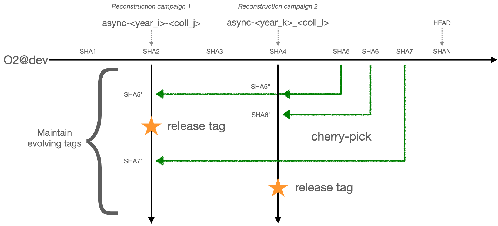

# Software releases for asynchronus reconstruction and simulation

```warning
The names of branches and tags used throughout this page are drafts and subject to change.
```

```note
From now on, requests have to be made by labelling the corresponding PRs with the respective labels.  
Opening additional MRs in this repository is obsolete.  
For dedicated information, please see [below](#mark-prs-to-be-cherry-picked-with-labels).  
```

## Request, cherry-pick, tag, release, start over

O2 and related software evolves over time. The global evolvement/development happens on their corresponding default branches.

Whenever data is reconstructed, that is done with a certain state of the software at that point in time. In that sense, one could say that running a new reconstruction campaign effectively **tags** the software.
In our case, the actual act of **tagging** happens on the level of `git`s history of our software packages.
Hence, whenever a new reconstruction campaign is run on data, the default branches shall be tagged at their current stage and a new branch, specifically for that reconstruction pass, is created from that tag. Any further reconstruction or simulation related to that reconstruction campaign is done based on that branch.

The figure below sketches the workflow branching, tagging and release procedure.

While still all developments go into the default branches, some of them might be necessary bug fixes or some required features that should for instance be used in upcoming simulation productions.
Those specific developments shall find their way to go be included in the current history of the tag that was used for a given reconstruction campaign via cherry-picking the corresponding commits from the default branch.

Packages affected by the approach are:

* O2,
* O2DPG,
* O2Physics,
* QualityControl (decision not yet final, to be discussed with the developers).

Packages that will be tagged in the same way (for consistency and transparency) but where no cherry-picks or dedicated PRs from user are taken:

* alidist.



## Mark PRs to be cherry-picked with labels

Whenever a bug fix or required feature needs to be contained in certain tag, the PR with those developments must be annotated with the label that corresponds to that reconstruction campaign.
Adding such a label means to **request** that this PR should be ported to be included in the next software tag.

```note
Labels can be added anytime but only PRs that have been **merged** into the default branches can be ported.
```

A special comment in the PR thread is used to trigger the addition of labels.
As of now, whenever a PR is (re)opened (so far functional in O2 and O2DPG), there will be an automatic message at as the first comment to that PR that instructs users (the list of labels might be different):

```instruction
**REQUEST FOR PRODUCTION RELEASES:**
To request your PR to be included in production software, please add the corresponding labels called "async-<name>" to your PR. Add the labels directly (if you have the permissions) or add a comment of the form (note that labels are separated by a ",")

`+async-label <label1>, <label2>, !<label3> ...`

This will add `<label1>` and `<label2>` and removes `<label3>`.

**The following labels are available**  
async-2022-pp-apass4  
async-2023-pbpb-apass3  
async-2023-pp-apass4  
async-2022-pp-apass6-2023-PbPb-apass2
```

Each label corresponds to a page where the **approved** requests are listed. The mapping of labels can be found at [here](../history/datasamples.md)

## Reviewing and accepting PRs (timeline)

```warning
Only requests that have been made before Wednesday 12:00 CERN time can be considered.
Requested PRs must be **merged** by that point, otherwise they cannot be considered.
PRs that were not accepted during the meeting will not be added to the release branches.
```

1. Wednesdays at 15:30 during the [WP12/13 meeting](https://indico.cern.ch/category/4868/): Approval of requested PRs is discussed based on what is listed [here](../requests_automatic/).
1. All approved PRs will try to be ported to the corresponding tags. If they do not apply cleanly, they cannot be taken (see more on that below).
1. Before the weekend: The new tags for simulation/reconstruction will be prepared. All ported PRs will have their corresponding request labels removed.
1. Tuesdays at 12:00: The [list of requests](../requests_automatic/) is updated and the link will be sent around with a meeting reminder. The list will contain also still open PRs that contain labels so that people can work on merging them.
1. Wednesdays at 12:00: A final update is applied to the [list of requests](../requests_automatic/).
1. Starting over...

### If PRs (their commits) do not apply cleanly

In this case, the requestors are asked to find all other PRs/commits that would be required to be ported such that their original PR commits can be applied cleanly. These PRs would need to be marked with the corresponding labels. In addition, the responsible people are asked to also get in touch with DPG via email in addition.

### If requested PRs do not appear on the pages

If requested PRs do not appear on the [request pages](../requests_automatic/), please get in touch with the DPG convenors.

## Find information on accepted and applied requests

There is a [collection of sub-pages](../accepted/) that list

* commits that have been cherry-picked per package,
* the latest tags per label,
* the history ("from -> to") of created tags.


